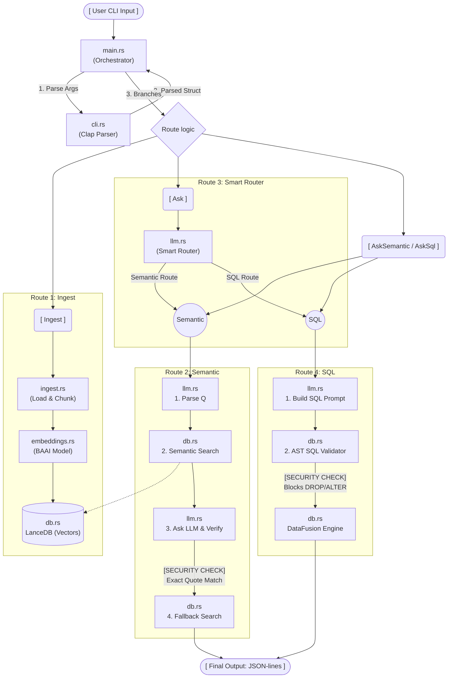

# Project Architecture (code_app)



## Execution Routes (CLI Mapping)

The application execution strictly follows 4 physical routes originating from the `cli.rs` parser and `main.rs` orchestrator:

1. **Route 1: `Commands::Ingest`**
   - **Flow:** `main.rs` -> Loads BAAI Embedding Model -> Calls `execute_ingestion()` in `ingest.rs`.
   - **Purpose:** Chunks raw SAP CSV files, generates mathematical vectors, and saves them to physical LanceDB storage.

2. **Route 2: `Commands::AskSemantic`**
   - **Flow:** `main.rs` -> LLM Intent Parser -> LanceDB `execute_semantic_search()` -> *(Optional Fallback Search)* -> LLM Hallucination Verifier.
   - **Purpose:** Executes fuzzy vector searches while mathematically isolating constraints and blocking AI hallucinations.

3. **Route 3: `Commands::Ask` (The Smart Router)**
   - **Flow:** `main.rs` -> LLM Router Prompt -> Branches dynamically into **Route 2** (Semantic) or **Route 4** (SQL).
   - **Purpose:** Analyzes the user's question to determine the correct database engine to use.

4. **Route 4: `Commands::AskAiSql` & `Commands::AskSql`**
   - **Flow:** `main.rs` -> LLM SQL Generator (if AI) -> DataFusion `init_datafusion()` -> `execute_sql_query()` (AST Validator Check).
   - **Purpose:** Executes exact quantitative filters on the raw CSV data, guarded by a strict Anti-Injection AST parser.

## System Data Schemas

### 1. Vector Database Schema (Apache Arrow)
The physical LanceDB database strictly enforces the following memory schema via `ingest.rs`:

| Field Name | Data Type | Nullable | Purpose |
|------------|-----------|----------|---------|
| `kunnr` | `Utf8` | `false` | Primary Key (SAP Customer Number). |
| `name` | `Utf8` | `false` | Customer Name. |
| `city` | `Utf8` | `false` | Customer Location. |
| `sentence` | `Utf8` | `false` | The raw text string embedded by the ML model. |
| `vector` | `FixedSizeList(Float32, 768)` | `false` | The mathematical coordinates generated by BAAI. |

### 2. LLM Communication Protocol
All traffic passing between Rust and the AI router is strictly typed via JSON schemas defined in `models.rs`:
```json
// Example: The ParsedQuestion boundary schema
{
  "intent": "technology companies",
  "filters": ["NOT in Berlin"]
}
```

## Infrastructure Boundary

This application is designed to be highly self-contained, but it does rely on the following external boundaries:
* **Ollama Daemon:** Must be running on the host network at `http://localhost:11434` with the `llama3` model installed.
* **LanceDB Storage:** The Rust engine automatically manages physical storage locally at `./data/sap_vectors`.
* **HuggingFace Cache:** The Rust `candle` framework automatically downloads and caches the `BAAI/bge-base` embedding models inside the host operating system's `~/.cache/huggingface/` directory.

## Future State (v3 Cloud Architecture)

Once we reach **Step 11 (Containerization)** on the roadmap, the CLI terminal input will be replaced by an `axum` REST API, wrapped in a strict Kubernetes Pod boundary:

```text
               [ Kubernetes Pod Boundary ]
+-------------------------------------------------------+
|                                                       |
|  +------------------------+      +-----------------+  |
|  | Container 1            |      | Container 2     |  |
|  | (Rust Axum REST API)   | <--> | (Ollama Daemon) |  |
|  +------------------------+      +-----------------+  |
|              |                                        |
|              v                                        |
|   [ Persistent Volume Claim ]                         |
|   (Mounted LanceDB Storage)                           |
+-------------------------------------------------------+
```
